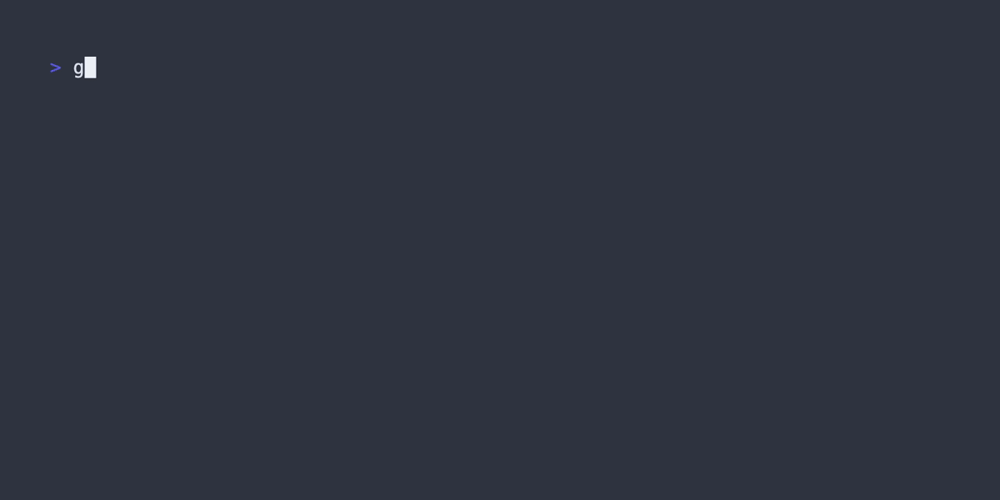

# Overlay
[](https://pkg.go.dev/github.com/rmhubbert/bubbletea-overlay) 

 [](CONTRIBUTING.md)

**Overlay** is a component for [Charm's Bubble Tea TUI framework](https://github.com/charmbracelet/bubbletea) that aims to simplify creating and managing overlays and modal windows in your TUI apps.



Credit where it is due, the compositing method used in this component is based on [Superfile's](https://github.com/yorukot/superfile/blob/main/src/pkg/string_function/overplace.go) implementation.

## Installation

```go
go get github.com/rmhubbert/bubbletea-overlay
```

## Usage

You can access the [full source code for the example application in the example directory](https://github.com/rmhubbert/bubbletea-overlay/tree/main/example), which should give you a good starting point.

Basically, **Overlay** is a standard `tea.Model instance`, so its lifecycle is identical to any other model in a Bubble Tea application. **Overlay** simply wraps two `tea.Models`, one that will render the background, and one that will render the foreground. Calling `View()` on the **Overlay** model will composite the foreground onto the background and return the result as a string.

### Updates
**Overlay** will not call `Update()` on the background and foreground models. This is by design, **Overlay** should only be concerned with handling the compositing of the two models, and should not presume that those models should currently receive an update. Manage those updates from the code that created the **Overlay** in the first place. An example of this can be seen in the `Manager` model in the [example application](https://github.com/rmhubbert/bubbletea-overlay/tree/main/example).

### Positioning

You can position your foreground model in two ways. Primarily, you set an `overlay.Position` for both the vertical and horizontal axes. Possible values as follows: 

- `overlay.Top`
- `overlay.Right`
- `overlay.Bottom`
- `overlay.Left`
- `overlay.Center`

As you can probably guess, these will allow you to position your overlay in combinations such as Right Top, Center Center, Left Bottom, etc, in relation to the background model.

In addition, you can also set X and Y offset values, which will be added to the X and Y `overlay.Position` values. This allows you to fine tune your postioning, or simulate a margin on your foreground model. 

### Lipgloss compatibility
**Overlay** should play nicely with [Charm's Lipgloss style definition library](https://github.com/charmbracelet/lipgloss) with one caveat; adding margins or positioning to the foreground model will probably not work as you are expecting. Use **Overlay**'s postioning and offsets instead. 

### Initialising

Use the `overlay.New()` function to ensure that the `overlay.Model` is properly initialised. It will return a pointer to a new instance of `overlay.Model`. The following example will create an overlay that is horizontally and vertically centered, with no offset, in relation to the background.

```go
bgModel := &background.Model{}
fgModel := &foreground.Model{}
xPosition := overlay.Center
yPosition := overlay.Center
xOffset := 0
yOffset := 0

overlayModel := overlay.New(fgModel, bgModel, xPosition, yPosition, xOffset, yOffset)
```
## License

**Overlay** is made available for use via the [MIT license](LICENSE).

## Contributing

Contributions are always welcome via [Pull Request](https://github.com/rmhubbert/bubbletea-overlay/pulls). Please make sure to add tests and make sure they are passing before submitting. It's also a good idea to lint your code with golint.

Contributors are expected to abide by the guidelines outlined in the [Contributor Covenant Code of Conduct](CONTRIBUTING.md)
